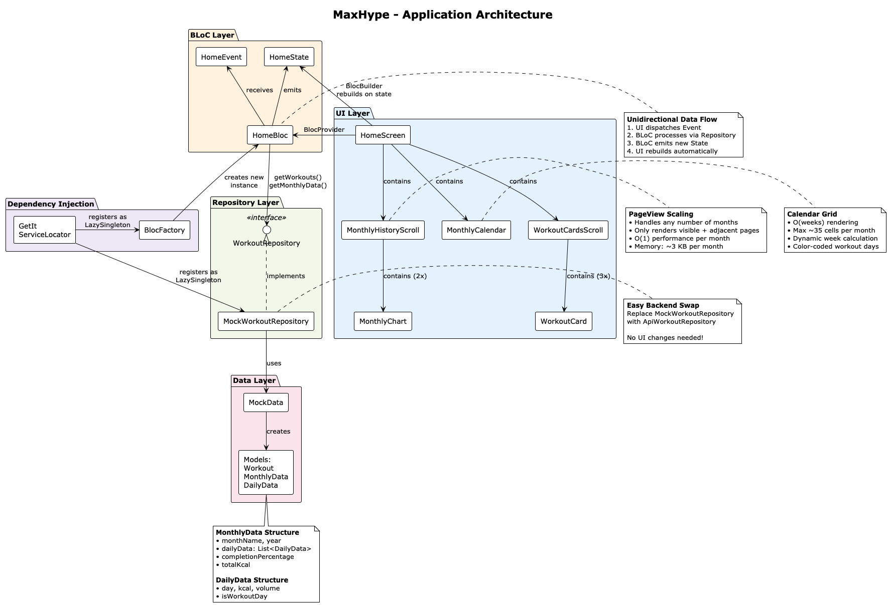

# MaxHype - Architecture Overview

## Component Structure

The application follows **Clean Architecture** with **BLoC pattern** for state management:

```
UI Layer (Widgets)
    ↓
BLoC Layer (Business Logic)
    ↓
Repository Layer (Data Interface)
    ↓
Data Layer (Mock/API)
```

### Main Components

1. **HomeScreen** - Main container with BLoC integration
2. **AppHeader** - Title and subtitle display
3. **WorkoutCardsScroll** - Horizontal scrollable workout cards
4. **MonthlyCalendar** - Grid-based calendar with workout tracking
5. **MonthlyHistoryScroll** - Page-based month navigation with charts

## Data Handling

### State Management Flow

1. **GetIt Service Locator** - Dependency injection at app startup
2. **HomeBloc** receives `HomeInitial` event
3. **BLoC** calls `WorkoutRepository.getWorkouts()` and `getMonthlyData()`
4. **Repository** returns `Future<List<Workout>>` and `Future<List<MonthlyData>>`
5. **BLoC** emits `HomeSuccess` state with data
6. **UI** rebuilds with new data via `BlocBuilder`

### Data Models

```dart
MonthlyData {
  monthName: String
  year: int
  dailyData: List<DailyData>  // One per day of month
  completionPercentage: double
  totalKcal: double
}

DailyData {
  day: int
  kcal: double
  volume: double
  isWorkoutDay: bool
}
```

## Scaling with More Months

### Current Implementation (3 months)

- Generates data for current month + 2 previous months
- Uses **PageView** for horizontal month navigation
- Each page contains 2 charts (KCAL + Volume)

### How It Scales

**Efficient scaling approach:**

1. **Lazy Loading** - Only 3 months loaded in memory at a time
2. **PageView with PageController** - Handles any number of pages efficiently
3. **Calendar Grid O(weeks)** - Renders ~4-5 weeks per month maximum
4. **Chart Data Filtering** - Only workout days plotted (reduces chart complexity)

**To add more months:**

```dart
// In MockData.getMonthlyData()
final months = <MonthlyData>[];
for (int i = 0; i < 12; i++) {  // Change from 3 to 12 months
  final date = DateTime(now.year, now.month - i, 1);
  months.add(_generateMonthData(date, random));
}
```

**Performance remains O(1) per month** because:
- PageView only renders visible page + adjacent pages
- Calendar grid size is constant (~35 cells max)
- Charts filter and display ~9-12 workout days per month

**Memory footprint scales linearly** but remains small:
- 12 months × 30 days × ~100 bytes per DailyData = ~36 KB total

---

## Architecture Diagram



The diagram above illustrates the layered architecture of the MaxHype application, showing:

- **UI Layer**: Screen components and widgets
- **BLoC Layer**: Business logic and state management
- **Repository Layer**: Abstract data interface
- **Data Layer**: Mock data generators and models
- **Dependency Injection**: GetIt service locator and BlocFactory

Key design notes:
- **PageView** efficiently handles any number of months
- **Calendar** renders with O(weeks) complexity (~35 cells max per month)
- **Repository pattern** allows easy swap between mock and real API

For the PlantUML source, see [architecture.puml](architecture.puml).

---

## Key Scaling Features

### 1. Month Navigation
- **PageView** with reverse order (newest first)
- Animated dot indicator shows current position
- Swipe left/right to navigate months

### 2. Data Generation Pattern
- Each month has independent `List<DailyData>`
- Workout days randomly distributed (~3 per week)
- Progressive values (older months have lower base values)

### 3. Calendar Rendering
- Calculates first weekday: `DateTime(year, month, 1).weekday`
- Dynamically calculates weeks: `ceil((firstWeekday + daysInMonth) / 7)`
- Color-codes workout days (green) vs rest days (gray)

### 4. Chart Optimization
- Filters only workout days for plotting
- Uses fl_chart library (hardware-accelerated)
- Gradient fills and shadows for visual appeal

---

## To Add Real Backend

Replace `MockWorkoutRepository` with:

```dart
class ApiWorkoutRepository implements WorkoutRepository {
  final ApiClient _client;

  @override
  Future<List<MonthlyData>> getMonthlyData() async {
    final response = await _client.get('/api/monthly-data');
    // Parse and return data
  }
}
```

Register in `service_locator.dart`:
```dart
getIt.registerLazySingleton<WorkoutRepository>(
  () => ApiWorkoutRepository(getIt<ApiClient>()),
);
```

**No UI changes required** - architecture handles the swap seamlessly.
